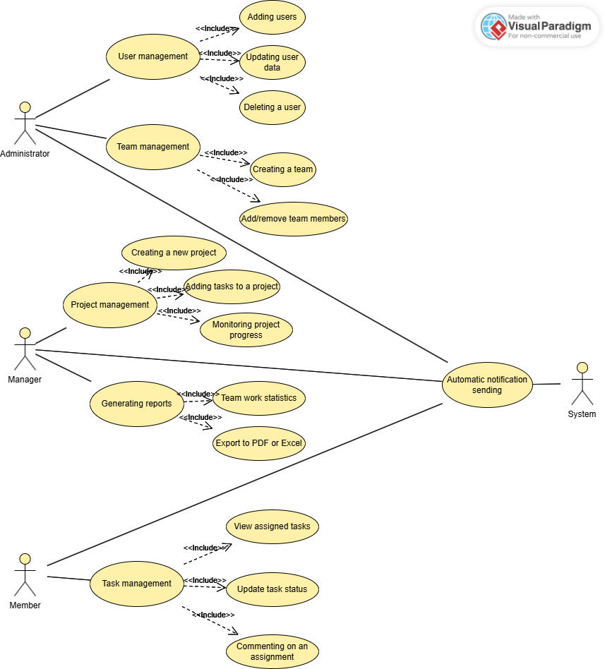
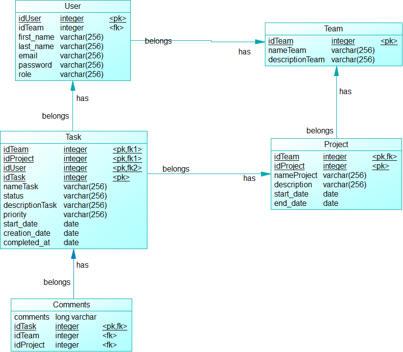
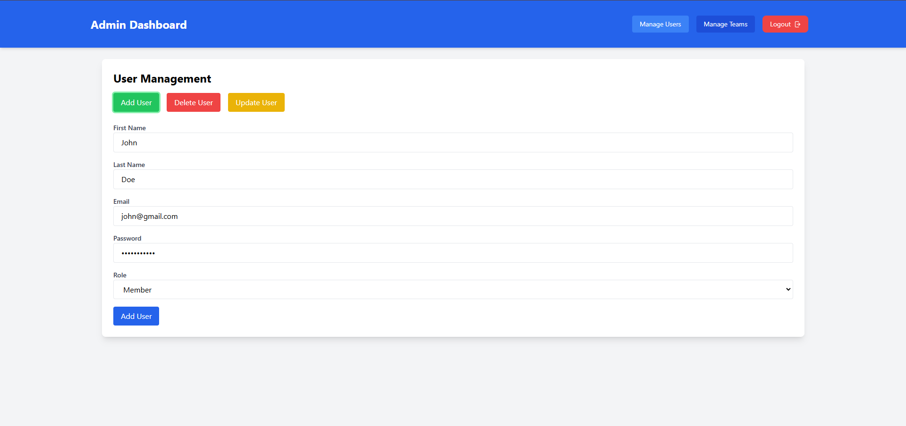
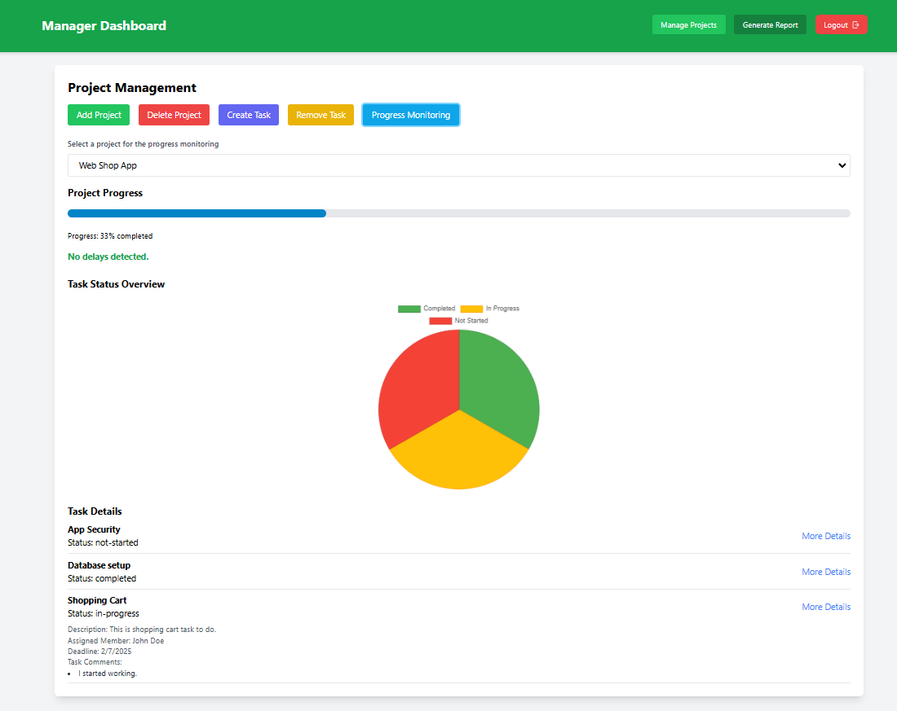
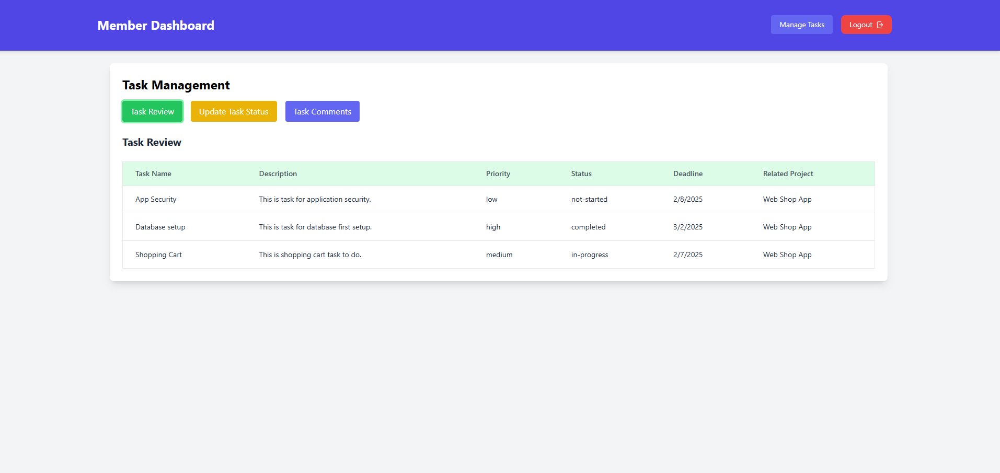

# **Team Project Management System**

**Live Demo**: [Team Project Manager](http://spring-task-manager.s3-website.eu-central-1.amazonaws.com/)

A **Spring Boot microservices-based project** for team, project and task management. 
The backend was built with **Spring Boot**, the frontend with **React** 
and the primary database was created with **PostgreSQL**. The application 
is containerized using **Docker** and deployed on **AWS**.

---

## **Table of Contents**

- [About](#about)
- [Features](#features)
- [Architecture Overview](#architecture-overview)
- [Tech Stack](#tech-stack)
- [Project Structure](#project-structure)
- [Prerequisites](#prerequisites)
- [Installation](#installation)
- [Usage](#usage)
- [Screenshots](#screenshots)
- [Contributing](#contributing)
- [License](#license)
- [Author](#author)

---

## **About**

The **Team Project Management System** is made to assist businesses with task delegation team organization and project progress monitoring. Project management, real-time email notifications and **authentication and authorization** are all included. The database is housed on **AWS RDS** and the system is deployed on **AWS EC2** and **AWS S3**.

---

## **Features**

- User authentication and role-based authorization (Admin, Manager, Member)
- Team creation and management
- Project and task management
- Real-time notifications via email
- RESTful APIs for each service

---

## **Architecture Overview**

The application is divided into the following microservices:

1. **Auth Service**: Manages user authentication, registration, and role-based authorization.
2. **Task Management Service**: Handles projects, task assignments, and tracking.
3. **Notification Service**: Sends email notifications.

All services are containerized using **Docker Compose**.

### **Architecture:**
```plaintext
+-----------------------------------------------------------+
|               Client (Frontend: React)                    |
+----------------------------+------------------------------+
                             ↓
+----------------------------+------------------------------+
|                       RESTful API                         |
+----------------------------+------------------------------+
                             ↓
+-------------------+    +----------------+    +----------------+
|  Auth Service     |    |  Task Service  |    |  Notification  |
| (Spring Security) |    |  (Spring Boot) |    |  (Spring Boot) |
+-------------------+    +----------------+    +----------------+
          ↓                         ↓                    
+-----------------------+  +----------------------+
|  PostgreSQL (auth_db) |  | PostgreSQL (task_db) |
+-----------------------+  +----------------------+
```
---

## **Tech Stack**

### **Backend**
- **Java 17**: Main programming language
- **Spring Boot**: Core framework for microservices
- **Spring Security**: Authentication and authorization
- **Spring Data JPA**: ORM and database access
- **PostgreSQL**: Database

### **Frontend**
- **React**: Building user interface
- **Tailwind CSS**: Styling

### **Infrastructure**
- **Docker & Docker Compose**: Containerization
- **AWS EC2**: Cloud deployment
- **AWS RDS**: Managed database
- **AWS S3**: Frontend hosting

### **Others**
- **Maven**: Dependency management
- **Lombok**: Reducing boilerplate code
- **Dotenv**: Managing environment variables
- **JWT**: Token-based authentication
- **Gmail SMTP**: Real-time notifications

---

## **Project Structure**

```plaintext
team-project-manager/
│
├── backend/
│   ├── auth-service/
│   ├── task-service/
│   ├── notification-service/
│   ├── .idea/
│   ├── .mvn/
│   ├── .env
│   ├── pom.xml
│   └── docker-compose.yml
├── README.md
└── frontend/
```
---

## **Prerequisites**

Verify that the following is installed on your computer:

- [Docker](https://docs.docker.com/get-docker/)
- [Java 17](https://www.oracle.com/java/technologies/javase/jdk17-archive-downloads.html)
- [Maven](https://maven.apache.org/)

---

## **Installation**

1. **Clone the repository**:
    ```bash
    git clone https://github.com/StefanSirkovic/spring-microservices-project-management.git
    cd team-project-manager/backend
    ```
    
2. **Build the backend services**:
    ```bash
    mvn clean package -DskipTests
    ```

    This will generate `.jar` files for each microservice in their `target/` directories.

3. **Build and run the Docker containers**:

- **Backend**:  
    Navigate to the `backend/` directory and run:

    ```bash
    docker-compose up --build
    ```

    This will start all backend microservices, databases, and dependencies.

- **Frontend**:  
    Navigate to the `frontend/` directory and run:

    ```bash
    docker-compose up --build
    ```

    This will start the React-based frontend locally on **port 3000**.

4. **Verify the services**:

    - **Frontend**: Open your browser and navigate to:  
      [http://localhost:3000](http://localhost:3000)  

    - **Database Management**:  
      The PostgreSQL database can be managed via **PgAdmin** at:  
      [http://localhost:5050](http://localhost:5050)  
      Use the credentials set in `application.yml` file for access.

---

## **Usage**

The **Admin Dashboard**, **Manager Dashboard** and **Member Dashboard** are the three sections of the system.

### **1. Login and User Registration**
- Navigate to the **[Login Page](http://localhost:3000/)**.
- **Registration:** To register users must enter their first and last names, email address, password and role (Admin, Manager or Member).
- **Login:** After successful registration, users can use their login credentials to access their account.

Upon successful login users will be taken to the dashboard according to their role.

---

### **2. Admin Dashboard Features**
This dashboard which is accessible to users with the **Admin role** enables the management of teams and users.

- **Add User:**  
  Admins can add users by entering their information.

- **Delete User:**  
  Users who are no longer using the system should be removed.  
  
- **Update User:**  
  Make changes to the users name, email, password or role.

- **Create Team:**  
  Admins can create new teams by assigning a team name and description.

- **Delete Team:**  
  It is possible to remove teams from the system that are no longer needed.

- **Add Team Member:**  
  Admins can assign users to specific teams.

- **Remove Team Member:**  
  Users who have withdrawn from a team can be removed by administrators.

---

### **3. Manager Dashboard Features**
The **Manager Dashboard** makes it possible to track team performance and manage tasks and projects.

- **Add Project:**  
  Managers can create new projects by entering a project name, description, start date, end date and team members.

- **Delete Project:**  
  You can remove projects that are finished or no longer necessary.

- **Create Task:**  
  Tasks can be created within projects, including task descriptions and deadlines.

- **Remove Task:**  
  Eliminate unnecessary tasks.

- **Progress Monitoring:**  
  Managers can monitor the progress of ongoing projects and review team performance.

- **Team Statistics:**  
  See the performance indicators of various teams such as individual contributions ongoing projects and task completion rates.

- **Export:**  
  Team performance reports can be exported for offline review and reporting to **PDF** or **Excel**.

---

### **4. Member Dashboard Features**
With the **Member Dashboard** members can see and manage the tasks that have been assigned to them.

- **Task Review:**  
  Tasks assigned to members can be tracked along with their details and deadlines.

- **Update Task Status:**  
  Members can update the status of their tasks (e.g., In Progress, Completed).

- **Task Comments:**  
  On tasks, members can post comments to offer updates.

---

## **Screenshots & Diagrams**

### **1. Use Case Diagram**



---

### **2. Database Diagram**



---

### **3. Admin Dashboard**



---

### **4. Manager Dashboard**



---

### **5. Member Dashboard**



---

## **Contributing**

To contribute:

1. **Fork the repository** by clicking on the "Fork" button at the top-right corner of the GitHub repository page.
2. **Clone the repository** to your local machine:
   ```bash
   git clone https://github.com/StefanSirkovic/spring-microservices-project-management.git
   ```
3. **Create a new branch** for your feature or bug fix:
   ```bash
   git checkout -b feature/YourFeatureName
   ```
4. **Make changes and commit them:**
   ```bash
   git add .
   git commit -m "Your descriptive commit message"
   ```
5. **Push the changes** to your forked repository:
   ```bash
   git push origin feature/YourFeatureName
   ```
6. **Submit a Pull Request:** Go to the GitHub repository and open a new Pull Request.      

---

## **License**

This project is licensed under the [MIT License](https://opensource.org/licenses/MIT).

---

## **Author**

- **Stefan Sirkovic**  
  [Connect on LinkedIn](https://www.linkedin.com/in/stefansirkovic/)  
  **Contact:** [stefansirkovic@gmail.com](mailto:stefansirkovic@gmail.com)


